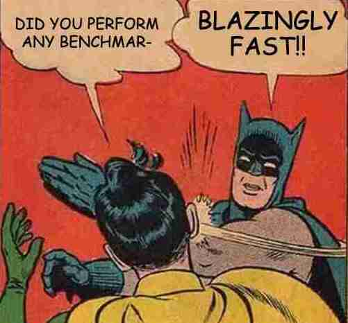

# aaha-template

- [axum](https://github.com/tokio-rs/axum)
- [askama](https://github.com/djc/askama)
- [htmx](https://htmx.org)
- [alpine](https://alpinejs.dev)

## Summary

A blazingly fast template for web development in Rust with HTMX.
This template aims to keep complexity low.

## Overview

#### assets/

Assets loaded into memory and served statically on `/assets`.

Assets in `assets/artifacts/` are build artifacts and gitignored.
For example, the output CSS file.

#### src/route/

Server endpoints, for both API and pages.
Since the template is for HTMX, the API endpoints would return HTML instead
of e.g. JSON.

#### styles/

SCSS styles.

On build, using the `build.rs` script, these are bundled into the
output CSS file at `assets/artifacts/bundle.css`.

#### templates/

Askama templates.

The directory is split into `components/`, `layouts/` and `pages/`.
